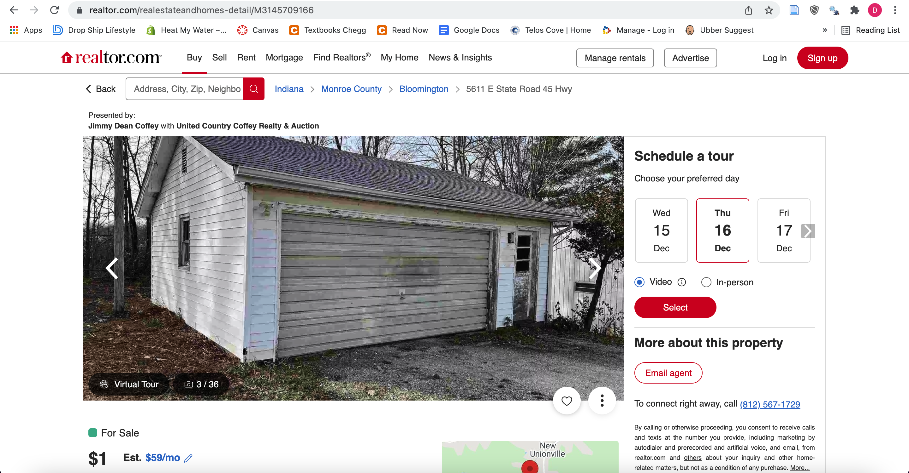
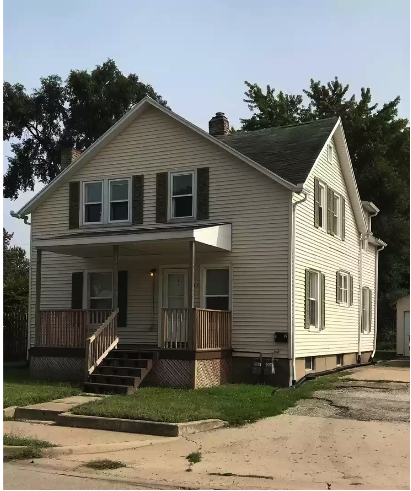
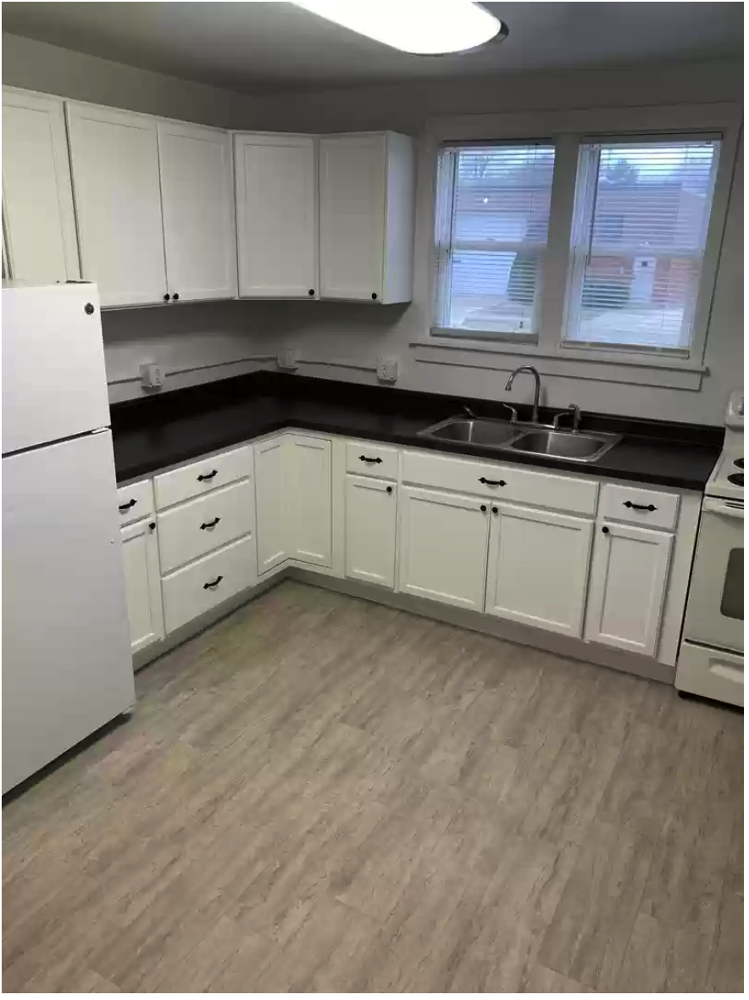
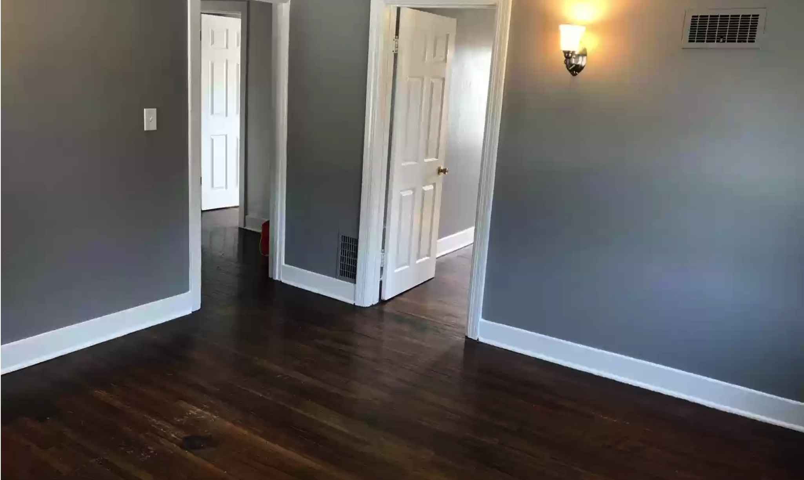
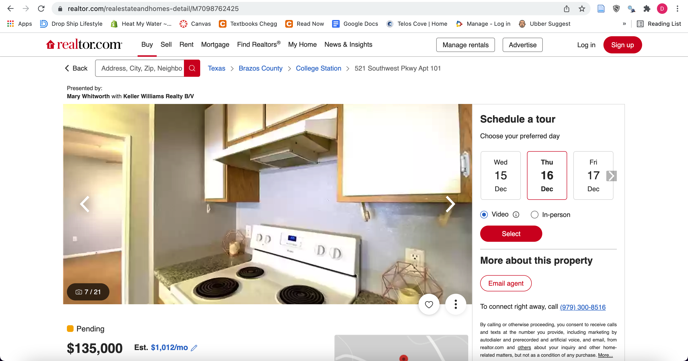

```{r setup, include=FALSE, echo=FALSE, message=FALSE, warning=FALSE}
knitr::opts_chunk$set(echo = FALSE, message = FALSE, warning = FALSE)
options("scipen" = 10)
options()$scipen
```


<style type="text/css">

h1.title {
  font-size: 42px;
  font-family: "Times New Roman", Times, serif;
  color: Black;
  text-align: center;
}

h4.author { /* Header 4 - and the author and data headers use this too  */
    font-size: 18px;
    font-family: "Times New Roman", Times, serif;
  color: gray;
  text-align: center;
}
h4.date { /* Header 4 - and the author and data headers use this too  */
  font-size: 18px;
  font-family: "Times New Roman", Times, serif;
  color: gray;
  text-align: center;
}
h1 {
  font-size: 34px;
  font-family: "Times New Roman", Times, serif;
  color: Black;
  text-align: left;
}
 p {
  font-size: 18px;
  font-family: "Times New Roman", Times, serif;
  color: Black;
  text-align: left;
}
h1, .h1, h2, .h2, h3, .h3 {
    margin-top: 84px;
}
</style>


# A little introduction to my project

The idea for this project came from a conversation I had just a few months back. I was catching-up with an old roommate of mine who has since found himself exploring the world of real estate. He was explaining to me how his research has led him to focus his attention on student rental properties, just like the one we used to live in together. As a poor college student myself, the idea of generating some passive income is more than enticing. It was very soon in the conversation, however, that I realized his method of finding properties to rent was fairly inefficient. The thought then came to me: if my friend can have so much success with his current strategy to find properties, surely I could have the same success by developing an even better strategy! Thus, I set-out to find my next student rental property and here's what I found...

# Planning

First, I wanted to narrow down the search of properties to those which are located near university campuses that will **consistently have the greatest amount of students looking for a place to live.**  
To do this, I searched the web for the universities with the greatest undergraduate population. I scraped (using rvest) this [wikipedia page](https://en.wikipedia.org/wiki/List_of_United_States_public_university_campuses_by_enrollment) that had a neatly kept list of the Top 10 Most Populous Universities and their undergraduate populations from 2009 to present.

```{r echo=FALSE, message=FALSE, warning=FALSE}
library(tidyverse)
library(rvest)
library(readxl)
library(kableExtra)

page <- read_html("https://en.wikipedia.org/wiki/List_of_United_States_public_university_campuses_by_enrollment")
campus <- page %>% 
  html_elements("td:nth-child(2) > a") %>% html_text()
city <- page %>% 
  html_elements("td:nth-child(3) > a") %>% html_text()
pop <- page %>% 
  html_elements("td:nth-child(4)") %>% html_text()

city <- city[!city == "Minneapolis"]
city <- city[!city == "Urbana"]
city <- city[!city == "Miami"]
city <- city[!city == "Minnesota"]

city[city == "Saint Paul, Minnesota"] <- "Minneapolis/Saint Paul, Minnesota"
city[city == "Minneapolis-Saint Paul"] <- "Minneapolis/Saint Paul, Minnesota"
city[city == "Champaign, Illinois"] <- "Urbana/Champaign, Illinois"
city[city == "Florida"] <- "Miami, Florida"


pop <- str_remove_all(pop, "\n")
pop <- str_remove_all(pop, ",")
pop <- str_remove_all(pop, ">")
pop <- as.numeric(pop)


df <- data.frame(campus, str_split_fixed(city, ", ", 2), pop)
names(df)[names(df) == "X1"] <- "city"
names(df)[names(df) == "X2"] <- "state"

year1 <- c(rep("2021", 10), rep("2020", 10), rep("2019", 10), rep("2018", 10), 
  rep("2017", 10), rep("2016", 10), rep("2015", 10), rep("2014", 10), 
  rep("2013", 10), rep("2012", 10), rep("2011", 10), rep("2010", 10))
year2<- c(rep("2020", 10), rep("2019", 10), rep("2018", 10), rep("2017", 10), 
          rep("2016", 10), rep("2015", 10), rep("2014", 10), rep("2013", 10), 
          rep("2012", 10), rep("2011", 10), rep("2010", 10), rep("2009", 10))
year1 <- as.numeric(year1)
year2 <- as.numeric(year2)
df$year_finish <- year1
df$year_start <- year2
df <- df %>% 
  select(year_start, year_finish, everything())
df$state[df$state == "TX"] <- "Texas"
```

Here's a look at the first 10 rows:

```{r}
first <- df %>% head(10)
kable(first) %>% 
  kable_styling(latex_options = "striped")
```

And here's a look at each campus on the Wikipedia page through the years:  
*Note that some campuses made the list only a few times, whereas others were on the list every year.*

```{r, fig.width=10, fig.height=8}
df %>% 
  ggplot(aes(x = year_finish, y =pop, color = state)) +
  geom_point() +
  geom_smooth() +
  facet_wrap(~campus) +
  theme_minimal() +
  theme(axis.text.x = element_text(angle = 60, hjust = 1)) +
  labs(x="Year", y="Population")
```

Finally, here is a list of the schools that were in the Top 10 Most Populous Universities for over ten years and the number of years they were on it. These schools **consistently had the greatest amount of students looking for a place to live.**

```{r}
appearances <- df %>% count(campus, name = "num")
appearances <- arrange(appearances, desc(num))
most_popular <- appearances[appearances$num > 10,]

kable(most_popular) %>% 
  kable_styling(latex_options = "striped")
```

# But, wait...
What if these universities house the majority of their students on campus? To account for this, I had to do a little more digging. I visited a variety of sources to determine what percent of students typically live on-campus vs off-campus at each of the previously mentioned universities, and then compiled a list. Here's a look at those percentages:

```{r}
living <- read_xlsx("./../data/commuter.xlsx")
kable(living) %>% 
  kable_styling(latex_options = "striped")
```

I then used these percentages to estimate the amount of the undergraduate students that will be looking for off-campus housing at each of these universities:  
*Note: although Texas A&M has a higher student population overall, the University of Central Florida most likely has more students in search of off-campus housing (and, hopefully, my rental property!)*

```{r}
df <- read_csv("./../data/population_1.csv")

df <- df %>% 
  arrange(desc(year_finish), desc(pop_adjusted))
head <- df %>% head(15)
kable(head) %>% 
  kable_styling(latex_options = "striped")
```

Here is a look at the mean of the adjusted populations for each university since 2009. The schools which are consistently in the Top Ten Most Populous Universities in the country are highlighted in yellow.

```{r}
most_pop <- df %>% 
  group_by(campus) %>% 
  summarise(mean_pop = mean(pop_adjusted)) %>% 
  arrange(desc(mean_pop))

kable(most_pop) %>% 
  kable_styling(latex_options = "striped") %>% 
  row_spec(1:4, background = "yellow") %>% 
    row_spec(7:8, background = "yellow") %>% 
    row_spec(10:11, background = "yellow")

```

If I am going to find a rental property, these seem like a pretty good place to start looking! These universities **consistently have the greatest amount of students looking for a place to live off-campus.**

# Finding the Property
Finding the ideal property was no easy task. Although the web seems to be filled with an enormous amount of real estate data, most of this data is either kept private or is untrustworthy. In order to get my hands on the data I needed, I had to write some code that could scrape one of the most popular real estate websites: [realtor.com](https://www.realtor.com/).  
*Note: I made sure to check [www.realtor.com/robots.txt](https://www.realtor.com/robots.txt) to ensure that I wasn't scraping pages that are forbiden*
<br><br>
Here's a look at the for-loop I created to find the metrics I was looking for:

```{r, eval=FALSE, echo=TRUE}
library(tidyverse)
library(rvest)

cities <- c("College-Station_TX", "Orlando_FL", "Miami_FL", "Columbus_OH", 
            "Gainesville_FL", "Austin_TX", "Minneapolis_MN", "Atlanta_GA",
            "Tempe_AZ", "Champaign_IL", "Tampa_FL", "East-Lansing_MI",
            "University-Park_IL", "Bloomington_IN")

df1 = data.frame()

for (city in cities) {
  city_page = paste0("https://www.realtor.com/realestateandhomes-search/", city, "/beds-1/sqft-500/pg-")
  
  for (page_result in 1:8) {
    
    link = paste0(city_page, page_result, "")
    Sys.sleep(time = 10)
    page = read_html(link)
    
    address = page %>% html_nodes(".srp-address-redesign") %>% html_text()
    price = page %>% html_nodes(".srp-page-price > .bowEcH") %>% html_text()
    beds = page %>% html_nodes(".srp_list:nth-child(1)") %>% html_text()
    baths = page %>% html_nodes(".srp_list:nth-child(2)") %>% html_text()
    sq_ft = page %>% html_nodes(".srp_list:nth-child(3)") %>% html_text()
    location = rep(city, length(address))
    
    df1 = rbind(df1, data.frame(address, price, beds, baths, sq_ft, location,
                                stringsAsFactors = FALSE))
    
    print(paste("Page:", page_result))
    
    Sys.sleep(time = 5)
  }
  
  Sys.sleep(time=20)
  
  
}

write_csv(df1, file = "./../data/realtor.csv")

```

The beautiful thing about this code is that, with permission from Realtor.com, I will always have access to the most updated real estate listings from these fourteen cities in one neat and concise data frame. What would normally take hours of shuffling through page after page of search results, and manually imputing data into an excel spreadsheet, now takes minutes. Those few lines of code allow me to access thousands of up-to-date real estate listings in an easy-to-read format that I can manipulate to find the results I am looking for.  
Here's what it looks like:

```{r}
df <- read_csv("./../data/housing_metrics_clean")
df <- df[df$beds < 10,] 
df %>% head(10) %>% kable() %>% kable_styling(latex_options = "striped")
```

When I first set out on this project, I wanted to compare home prices with the average price of rent for one bedroom in each city. This way I could estimate how much I would cash-flow from each property every month. Unfortunately, it wasn't long before I realized that the average price of rent for any size home would be an extremely difficult number to estimate, if at all truly possible. So, instead, I had to rely on the metrics that I already had.  
I knew that the most profitable home would be the one with the most rooms to rent out and the smallest monthly payment. In other words, I wanted to find which properties would offered me the most rooms at the lowest price. So, I create a new column on my data frame where I divided the price of every home by the number of rooms it has. It is listed here as "return":
*Note: I decided to filter out all the homes with less than 3 rooms and less than 2 bathrooms.*

```{r}
df <- read_csv("./../data/housing_metrics_clean")
df <- df[df$beds < 10,]
df <- df[df$beds >2,]
df <- df[df$baths > 1.5,]

df$return <- df$price / df$beds

df$return <- as.numeric(formatC(df$return, digits = 2, format = "f"))

df <- df %>% 
  arrange(return)

df %>% head(10) %>% kable() %>% kable_styling(latex_options = "striped")

```
<br>
You're telling me there are properties listed for $1?? You bet I'm checking this out!
<br><br>



<br><br>
Hmmm... I don't know how appealing this will be to potential tenants... better keep looking!  
That 6 bed home in Champaign looks interesting... better take a look!

<br><br>





# Ta Da!
Now that's more like it! It looks like this home has been on the market for a few months, but the owners are now facing foreclosure and recently dropped the price to what it is. The home has 6 bedrooms, 2 bathrooms, as well as two kitchens, a two-car garage, a new roof, and some new renovations! Plus, it's only a 9 minute drive to the University of Illinois at Urbana–Champaign! After 12 months of renting out each room at $400 a room, I would be bringing in an estimated \$1,777 a month (assuming a 20% down payment and a 30-year-loan with a fixed interest rate of 3.16%), while acquiring equity in the property. I think this is the deal I am looking for!

# One more thought
What about that list of eight schools that consistently made the Top 10 Most Populous Schools over the last 12 years? University of Illinois wasn't on it. Maybe I should narrow the list of properties to only those near these schools.

```{r}
top_8 <- c("Orlando", "College_Station", "Miami", "Columbus", 
           "Gainesville", "Austin", "Minneapolis", "Tempe")
top_8 <- df %>% 
  filter(city %in% top_8)
kableExtra::kable(head(top_8, 10)) %>% kableExtra::kable_styling(latex_options = "striped")
```

All of these properties look like they need some additional work, I'll keep looking down the list for something a little more... up-to-code...  
Found one!

```{r}
top_8[18,]
```

Here's the corresponding page on Realtor.com:
<br>




This condo is listed at /$135,000. It includes 4 beds (each with its own private bathroom), a pool, a volleyball court, and is within walking distance to Texas A&M! Sounds like an easy pitch to an Aggie! At \$500 a room, this property would cash-flow \$988 month while generating equity over-time. And with the Texas A & M undergraduate population growing the way it has been, there will always be students looking for a sweet place to live near campus. 

```{r}
df1 <- read_csv("./../data/population.csv")
tx <- df1 %>% 
  filter(campus == "Texas A&M University")
library(modelr)

mod <- glm(data = tx,
    formula = pop ~ year_finish)

add_predictions(tx, mod) %>% 
  ggplot(aes(x=year_finish,y=pop)) +
  geom_point() + 
  geom_smooth(method="lm",se=FALSE,linetype=2,alpha=.25) +
  geom_point(aes(y=pred),color="red") +
  theme_minimal() +
  labs(x = "Population", y="Year", title = "Texas A&M Undergraduate Population", subtitle = "Actual population shown in black, predicted population in red")
```

# Wrapping it up
This project was tough, but the results of it are incredibly useful. Even if I decide to wait before investing into real estate, as long as I have access to this code, I can come back years from now and, with the push of a button, have the most up-to-date real estate listings from these areas. I have come to appreciate how powerful the Rvest package can be! With a few tweaks, this whole system could become totally automated to the point where any city could be scraped from a number of websites (imagine doing this with the MLS!). Now, its time to make me some money...  


<br><br><br><br><br><br><br><br><br><br><br><br>